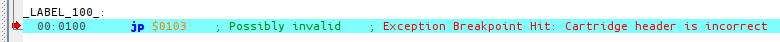
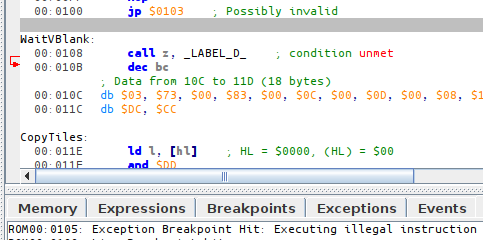

# Header

Let's go back to a certain line near the top of `hello-world.asm`.

```rgbasm,linenos,start=7
{{#include ../assets/hello-world.asm:10}}
```

What is this mysterious header, why are we making room for it, and more questions answered in this lesson!

## What is the header?

First order of business is explaining what the header *is*.
It's the region of memory from $0104 to $014F (inclusive).
It contains metadata about the ROM, such as its title, Game Boy Color compatibility, size,
two checksums, and interestingly, the Nintendo logo that is displayed during the power-on animation.

::: tip

You can find this information and more [in the Pan Docs](https://gbdev.io/pandocs/The_Cartridge_Header).

:::

Interestingly, most of the information in the header does not matter on real hardware (the ROM's size is determined only by the capacity of the ROM chip in the cartridge, not the header byte).
In fact, some prototype ROMs actually have incorrect header info!

Most of the header was only used by Nintendo's manufacturing department to know what components to put in the cartridge when publishing a ROM.
Thus, only ROMs sent to Nintendo had to have a fully correct header; ROMs used for internal testing only needed to pass the boot ROM's checks, explained further below.

However, in our "modern" day and age, the header actually matters a lot.
Emulators (including hardware emulators such as flashcarts) must emulate the hardware present in the cartridge.
The header being the only source of information about what hardware the ROM's cartridge should contain, they rely on some of the values in the header.

## Boot ROM

The header is intimately tied to what is called the **boot ROM**.

The most observant and/or nostalgic of you may have noticed the lack of the boot-up animation and the Game Boy's signature "ba-ding!" in Emulicious.
When the console powers up, the CPU does not begin executing instructions at address $0100 (where our ROM's entry point is), but at $0000.

However, at that time, a small program called the *boot ROM*, burned within the CPU's silicon, is "overlaid" on top of our ROM!
The boot ROM is responsible for the startup animation, but it also checks the ROM's header!
Specifically, it verifies that the Nintendo logo and header checksums are correct; if either check fails, the boot ROM intentionally *locks up*, and our game never gets to run :(

::: tip For the curious

You can find a more detailed description of what the boot ROM does [in the Pan Docs](https://gbdev.io/pandocs/Power_Up_Sequence), as well as an explanation of the logo check.
Beware that it is quite advanced, though.

If you want to enable the boot ROMs in Emulicious, you must obtain a copy of the boot ROM(s), whose SHA256 checksums can be found [in their disassembly](https://github.com/ISSOtm/gb-bootroms/blob/master/sha256sums.txt) for verification.
If you wish, you can also compile [SameBoy's boot ROMs](https://github.com/LIJI32/SameBoy#compilation) and use those instead, as a free-software substitute.

Then, in Emulicious' options, go to the `Options` tab, then `Emulation`→`Game Boy`, and choose which of GB and/or GBC boot roms you want to set.
Finally, set the path(s) to the boot ROM(s) you wish to use, and click `Open`.
Now, just reset the emulator, and voilà!

:::

A header is typically called "valid" if it would pass the boot ROM's checks, and "invalid" otherwise.

## RGBFIX

RGBFIX is the third component of RGBDS, whose purpose is to write a ROM's header.
It is separate from RGBLINK so that it can be used as a stand-alone tool.
Its name comes from that RGBLINK typically does not produce a ROM with a valid header, so the ROM must be "fixed" before it's production-ready.

RGBFIX has [a bunch of options](https://rgbds.gbdev.io/docs/rgbfix.1) to set various parts of the header; but the only two that we are using here are `-v`, which produces a **v**alid header (so, correct [Nintendo logo](https://gbdev.io/pandocs/The_Cartridge_Header.html#0104-0133---nintendo-logo) and [checksums](https://gbdev.io/pandocs/The_Cartridge_Header.html#014d---header-checksum)), and <code>-p&nbsp;0xFF</code>, which **p**ads the ROM to the next valid size (using $FF as the filler byte), and writes the appropriate value to the [ROM size byte](https://gbdev.io/pandocs/The_Cartridge_Header.html#0148---rom-size).

If you look at other projects, you may find RGBFIX invocations with more options, but these two should almost always be present.

## So, what's the deal with that line?

Right!
This line.

```rgbasm,linenos,start=7
{{#include ../assets/hello-world.asm:10}}
```

Well, let's see what happens if we remove it (or comment it out).

```console
$ rgbasm -L -o hello-world.o hello-world.asm
$ rgblink -o hello-world.gb -n hello-world.sym hello-world.o
```

(I am intentionally not running RGBFIX; we will see why in a minute.)



As I explained, RGBFIX is responsible for writing the header, so we should use it to fix this exception.

```console
$ rgbfix -v -p 0xFF hello-world.gb
warning: Overwrote a non-zero byte in the Nintendo logo
warning: Overwrote a non-zero byte in the header checksum
warning: Overwrote a non-zero byte in the global checksum
```

*I'm sure these warnings are nothing to be worried about...*
(Depending on your version of RGBDS, you may have gotten different warnings, or none at all.)

Let's run the ROM, click on Console on the debugger's bottom window, press <kbd><kbd>F5</kbd></kbd> a few times, and...

<figure>
  
  <figcaption>
    When the console reads "Executing illegal instruction", you <i>might</i> have screwed up somewhere.
  </figcaption>
</figure>


Okay, so, what happened?

As we can see from the screenshot, PC is at $0105.
What is it doing there?

...Oh, `EntryPoint` is at $0103.
So the `jp` at $0100 went there, and started executing instructions (`3E CE` is the raw form of `ld a, $CE`), but then $ED does not encode any valid instruction, so the CPU locks up.

But why is `EntryPoint` there?
Well, as you may have figured out from the warnings RGBFIX printed, it *overwrites* the header area in the ROM.
However, RGBLINK is **not** aware of the header (because RGBLINK is not only used to generate ROMs!), so you must explicitly reserve space for the header area.

::: danger:🥴

Forgetting to reserve this space, and having a piece of code or data ending up there then overwritten, is a common beginner mistake that can be quite puzzling.
Fortunately, RGBFIX since version 0.5.1 warns when it detects this mistake, as shown above.

:::

So, we prevent disaster like this:

```rgbasm,linenos,start=3
{{#include ../assets/hello-world.asm:6:10}}
```

The directive `ds` stands for "define space", and allows filling a range of memory.
This specific line fills all bytes from $103 to $14F (inclusive) with the value $00.
Since different pieces of code and/or data cannot overlap, this ensures that the header's memory range can safely be overwritten by RGBFIX, and that nothing else accidentally gets steamrolled instead.

It may not be obvious how this `ds` ends up filling that specific memory range.
The 3-byte `jp` covers memory addresses $100, $101, and $102.
(We start at $100 because that's where the `SECTION` is hardcoded to be.)
When RGBASM processes the `ds` directive, `@` (which is a special symbol that evaluates to "the current address") thus has the value $103, so it fills `$150 - $103 = $4D` bytes with zeros, so $103, $104, ..., $14E, $14F.

## Bonus: the infinite loop

(This is not really linked to the header, but I need to explain it somewhere, and here is as good a place as any.)

You may also be wondering what the point of the infinite loop at the end of the code is for.

```rgbasm
{{#include ../assets/hello-world.asm:68:69}}
```

Well, simply enough, the CPU never stops executing instructions; so when our little Hello World is done and there is nothing left to do, we must still give the CPU some busy-work: so we make it do nothing, forever.

We cannot let the CPU just run off, as it would then start executing other parts of memory as code, possibly crashing.
(See for yourself: remove or comment out these two lines, re-[compile the ROM](hello_world.md), and see what happens!)
