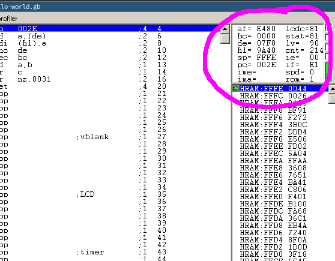

# Registers

Alright!
Now that we know what bits are, let's talk about how they're used.
Don't worry, this is mostly preliminary work for the next section, where we will—finally!—look at the code 👀

First, if you opened Emulicious, you have been greeted with just the Game Boy screen.
So, it's time we pop the debugger open!
Go to "Tools", then click "Debugger", or press <kbd><kbd>F1</kbd></kbd>.
Then in the debugger's menu, click "View", then click "Show Addresses"

<video controls poster="../assets/vid/debugger.poster.png">
	<source src="../assets/vid/debugger.webm" type="video/webm">
	<source src="../assets/vid/debugger.mp4" type="video/mp4">

	
</video>

The debugger may look intimidating at first, but don't worry, soon we'll be very familiar with it!
For now, let's focus on this small box near the top-right, the *register viewer*.

:::warning

The register viewer shows both *CPU registers* and some *hardware registers*.
This lesson will only deal with CPU registers, so that's why we will be ignoring some of these entries here.

:::

What are CPU registers?
Well, imagine you're preparing a cake.
You will be following a recipe, whose instructions may be "melt 125g of chocolate and 125g of butter, blend with 2 eggs" and so on.
You will fetch some ingredients from the fridge as needed, but you don't cook inside the fridge; for that, you have a small workspace.

Registers are pretty much the CPU's workspace.
They are small, tiny chunks of memory embedded directly in the CPU (only 10 bytes for the Game Boy's CPU, and even modern CPUs have less than a kilobyte if you don't count <a href="https://en.wikipedia.org/wiki/SIMD"><abbr title="Single Instruction, Multiple Data">SIMD</abbr></a> registers).
Operations are not performed directly on data stored in memory, which would be equivalent to breaking eggs directly inside our fridge, but they are performed on registers.

:::tip

There are exceptions to this rule, like many other "rules" I will give in this tutorial; I will paper over them to keep the mental complexity reasonable, but don't treat my word as gospel either.

:::

## General-purpose registers

CPU registers can be placed into two categories: *general-purpose* and *special-purpose*.
A "general-purpose" register (<abbr title="General-Purpose Register">GPR</abbr> for short) can be used for storing arbitrary integer numbers.
Some GPRs are special nonetheless, as we will see later; but the distinction is "can I store arbitrary integers in it?".

I won't introduce special-purpose registers quite yet, as their purpose wouldn't make sense yet.
Rather, they will be discussed as the relevant concepts are introduced.

The Game Boy CPU has seven 8-bit GPRs: `a`, `b`, `c`, `d`, `e`, `h`, and `l`.
"8-bit" means that, well, they store 8 bits.
Thus, they can store integers from 0 to 255 (%1111_1111 aka $FF).

`a` is the *accumulator*, and we will see later that it can be used in special ways.

A special feature is that these registers, besides `a`, are *paired up*, and the pairs can be treated as the 16-bit registers `bc`, `de`, and `hl`.
The pairs are *not* separate from the individual registers; for example, if `d` contains 192 ($C0) and `e` contains 222 ($DE), then `de` contains 49374 ($C0DE) = 192 × 256 + 222.
The other pairs work similarly.

Modifying `de` actually modifies both `d` and `e` at the same time, and modifying either individually also affects the pair.
How do we modify registers?
Let's see how, with our first assembly instructions!

:::challenge Challenge! 

1. You store the number `16` into the register `bc`, then store the number `14` into the register `c`. What is the current value of the register `bc`?
(HINT: you might need to do some conversions :>)
2. Can you store numbers larger than 255 into a single register? Why or why not?

  
Answer (Click me!)

### Answer 1
---
By converting `256` and `14` to their __BASE 2__ format 

 >  	(`%0000 0001 0000 0000` & `%0000 0000 0000 1110` respectively)

The computer will update the register `bc` with the format 

 >		`0000 0001 XXXX XXXX`
where you replace the _X_ 's with `%0000 1110`. 

This is possible only because you are updating the 4 bits in register `c`. Not the full 16.

This results in the answer `0001 1110` or `30`.

### Answer 2
---
Yes and No.
 
You can store numbers larger than `255` using a method we will go over later in this tutorial.

At this point however, numbers larger than `255` is not possible. 

`256`, when converted to __BASE 2__ results in `%1 0000 0000` which is 1 bit larger than what the register can hold. This will result in what is called an _overflow_

 

:::