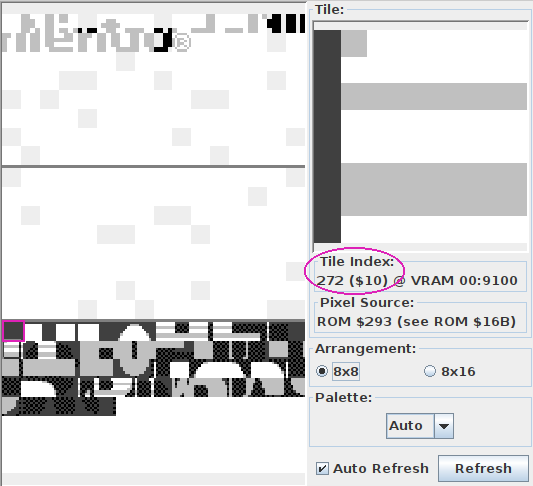
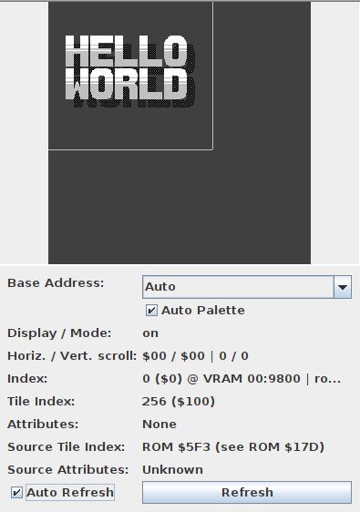
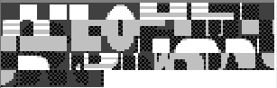
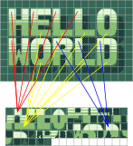

# Tilemap

:::tip:🧐

Some spell them "tile map", some "tilemap".
I will be using the latter by preference, but I also stay consistent with it in the code (`Tilemap` and not `TileMap`), as well as later when we will talk about attribute maps ("attrmap" and `Attrmap` instead of `AttrMap`).

:::

We are *almost* there.
We have seen how graphics on the Game Boy are composed of 8×8 "tiles", and we have seen how color is added into the mix.

But we have not seen yet how those tiles are arranged into a final picture!

Tiles are basically a grid of pixels; well, the tilemaps are basically a grid of tiles!
To allow for cheap reuse, tiles aren't stored in the tilemap directly; instead, tiles are referred to by an *ID*, which you can see in Emulicious' Tile Viewer.

<figure>
  
  <figcaption>
    The ID is displayed in hexadecimal without a prefix, so this is tile number $10, aka 16.
    As you may have noticed, the tiles are displayed in rows of 16, so it's easier to locate them by hexadecimal ID.
    Nifty!
  </figcaption>
</figure>

Now, of course, tile IDs are numbers, like everything that computers deal with.
IDs are stored in bytes, so there are 256 possible tile IDs.
However, the astute reader will have noticed that there are 384 tiles in total[^tile_blocks]!
By virtue of the [pigeonhole principle](https://en.wikipedia.org/wiki/Pigeonhole_principle), this means that some IDs refer to several tiles at the same time.

Indeed, Emulicious reports that the first 128 tiles have the same IDs as the last 128.
There exists a mechanism to select whether IDs 0–127 reference the first or last 128 tiles, but for simplicity's sake, we will overlook this for now, so please ignore the first (topmost) 128 tiles for the time being.

Now, please turn your attention to Emulicious' Tilemap Viewer, pictured below.

:::tip

You may notice that the image shown is larger than what is displayed on-screen.
Only part of the tilemap, outlined by a thicker border in the Tilemap Viewer, is displayed on-screen at a given time.
We will explain this in more detail in Part Ⅱ.

:::

Here we will be able to see the power of tile reuse in full force.
As a convenience and a refresher, here are the tiles our Hello World loads into VRAM:

You can see that we only loaded a single "blank" tile ($00, the first aka. top-left one), but it can be repeated to cover the whole background at no extra cost!

Repetition can be more subtle: for example, tile $01 is used for the top-left corner of the H, E, L, L, and W (red lines below)!
The R, L, and D also both share their top-left tile ($2D, blue lines below); and so on.
You can confirm this by hovering over tiles in the BG map tab, which shows the ID of the tile at that position.

<figure>
  
  <figcaption>
    Here are some examples of tile reuse. Not everything is drawn, as it would become a mess.
  </figcaption>
</figure>

All in all, we can surmise that displaying graphics on the Game Boy consists of loading "patterns" (the tiles), and then telling the console which tile to display for each given location.

---

[^tile_blocks]:
The even more astute (astuter?) reader will have noticed that 384 = 3 × 128.
Thus, tiles are often conceptually grouped into three "blocks" of 128 tiles each, which Emulicious shows as separated by thicker horizontal lines.
