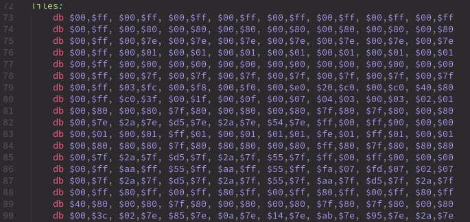

# Tiles

:::tip:💭

"Tiles" were called differently in documentation of yore.
They were usually called "patterns" or "characters", the latter giving birth to the "CHR" abbreviation which is sometimes used to refer to tiles.

For example, on the NES, tile data is usually provided by the cartridge in either [CHR ROM or CHR RAM](http://wiki.nesdev.com/w/index.php/CHR_ROM_vs._CHR_RAM).
The term "CHR" is typically not used on the Game Boy, though exchanges between communities cause terms to "leak", so some refer to the area of VRAM where tiles are stored as "CHR RAM" or "CHR VRAM", for example.

As with all such jargon whose meaning may depend on who you are talking to, I will stick to "tiles" across this entire tutorial for consistency, being what is the most standard in the GB dev community now.

:::

Well, copying this data blindly is fine and dandy, but why exactly is the data "graphics"?

<figure>
  
  <figcaption><q>Ah, yes, pixels.</q></figcaption>
</figure>

Let's see about that!

## Helpful hand

Now, figuring out the format with an explanation alone is going to be very confusing; but fortunately, Emulicious got us covered thanks to its *Tile Viewer*.
You can open it either by selecting "Tools" then "Tile Viewer", or by clicking on the grid of colored tiles in the debugger's toolbar.

You can combine the various VRAM viewers by going to "View", then "Combine Video Viewers".
We will come to the other viewers in due time.
This one shows the tiles present in the Game Boy's video memory (or "<abbr title="Video RAM">VRAM</abbr>").

:::tip:🤔

I encourage you to experiment with the VRAM viewer, hover over things, tick and untick checkboxes, see by yourself what's what. Any questions you might have will be answered in due time, don't worry! And if what you're seeing later on doesn't match my screenshots, ensure that the checkboxes match mine.

:::

Don't mind the "®" icon in the top-left; we did not put it there ourselves, and we will see why it's there later.

## Short primer

You may have heard of tiles before, especially as they were really popular in 8-bit and 16-bit systems.
That's no coincidence: tiles are very useful.
Instead of storing every on-screen pixel (144 × 160 pixels × 2 bits/pixel = 46080 bits = 5760 bytes, compared to the console's 8192 bytes of VRAM), pixels are grouped into tiles, and then tiles are assembled in various ways to produce the final image.

In particular, tiles can be reused very easily and at basically no cost, saving a lot of memory!
In addition, manipulating whole tiles at once is much cheaper than manipulating the individual pixels, so this spares processing time as well.

The concept of a "tile" is very general, but on the Game Boy, tiles are *always* 8 by 8 pixels.
Often, hardware tiles are grouped to manipulate them as larger tiles (often 16×16); to avoid the confusion, those are referred to as **meta-tiles**.

### "bpp"?

You may be wondering where that "2 bits/pixel" figure earlier came from...
This is something called "bit depth".

See, colors are *not* stored in the tiles themselves!
Instead, it works like a coloring book: the tile itself contains 8 by 8 *indices*, not colors; you give the hardware a tile and a set of colors—a **palette**—and it colorizes them!
(This is also why color swaps were very common back then: you could create enemy variations by storing tiny palettes instead of large different graphics.)

Anyway, as it is, Game Boy palettes are 4 colors large.[^pal_size]
This means that the indices into those palettes, stored in the tiles, can be represented in only *two bits*!
This is called "2 bits per pixel", noted "2bpp".

With that in mind, we are ready to explain how these bytes turn into pixels!

## Encoding

As I explained, each pixel takes up 2 bits.
Since there are 8 bits in a byte, you might expect each byte to contain 4 pixels... and you would be neither entirely right, nor entirely wrong.
See, each row of 8 pixels is stored in 2 bytes, but neither of these bytes contains the info for 4 pixels.
(Think of it like a 10 € banknote torn in half: neither half is worth anything, but the full bill is worth, well, 10 €.)

For each pixel, the least significant bit of its index is stored in the first byte, and the most significant bit is stored in the second byte.
Since each byte is a collection of one of the bits for each pixel, it's called a **bitplane**.

The leftmost pixel is stored in the leftmost bit of both bytes, the pixel to its right in the second leftmost bit, and so on.
The first pair of bytes stores the topmost row, the second byte the row below that, and so on.

Here is a more visual demonstration:

<iframe width="560" height="315" src="https://www.youtube-nocookie.com/embed/txkHN6izK2Y" title="YouTube video player" frameborder="0" allow="accelerometer; autoplay; clipboard-write; encrypted-media; gyroscope; picture-in-picture" allowfullscreen></iframe>

This encoding may seem a little weird at first, and it can be; it's made to be more convenient for the hardware to decode, keeping the circuitry simple and low-power.
It even makes a few cool tricks possible, as we will see (much) later!

You can read up more about the encoding [in the Pan Docs](https://gbdev.io/pandocs/Tile_Data.html) and [ShantyTown's site](https://www.huderlem.com/demos/gameboy2bpp.html).

In the next lesson, we shall see how colors are applied!

---

[^pal_size]:
Other consoles can have varying bit depths; for example, the SNES has 2bpp, 4bpp, and 8bpp depending on the graphics mode and a few other parameters.
