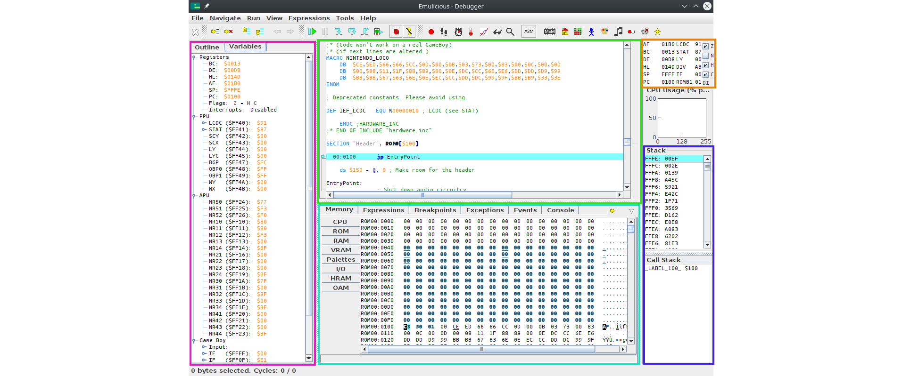
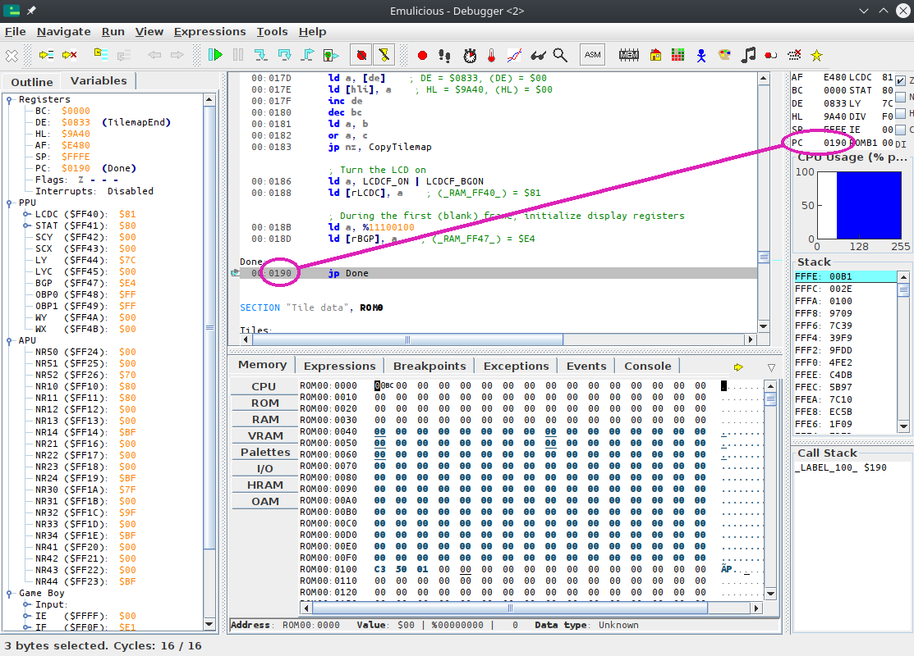
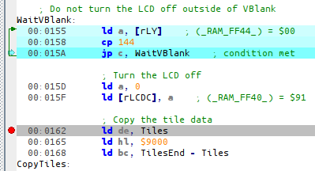
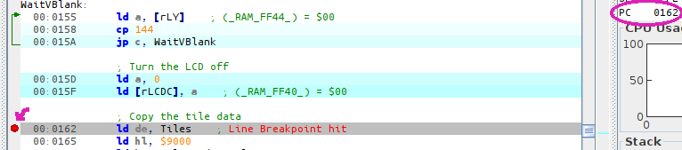
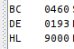

# Tracing

Ever dreamed of being a wizard?
Well, this won't give you magical powers, but let's see how emulators can be used to control time!

First, make sure to focus the debugger window.
Let's first explain the debugger's layout:

Top-left is the code viewer, bottom-left is the data viewer, top-right are some registers (as we saw in [the registers lesson](registers.html)), and bottom-right is the stack viewer.
What's the stack?
We will answer that question a bit later... in Part Ⅱ 😅

## Setup

For now, let's focus on the code viewer.

As Emulicious can load our source code, our code's labels and comments are automatically shown in the debugger.
As we have seen a couple of lessons ago, labels are merely a convenience provided by RGBASM, but they are not part of the ROM itself.
In other emulators, it is very much inconvenient to debug without them, and so sym files (for "**sym**bols") have been developed.
Let's run RGBLINK to generate a sym file for our ROM:

```console
$ rgblink -n hello-world.sym hello-world.o
```

::: warning:‼️

The file names matter!
When looking for a ROM's sym file, emulators take the ROM's file name, strip the extension (here, `.gb`), replace it with `.sym`, and look for a file **in the same directory** with that name.

:::

## Stepping

When pausing execution, the debugger will automatically focus on the instruction the CPU is about to execute, as indicated by the line highlighted in blue.


::: tip:ℹ️

The instruction highlighted in blue is always what the CPU is _about to execute_, not what it _just executed_. Keep this in mind.

:::

If we want to watch execution from the beginning, we need to reset the emulator.
Go into the emulator's "File" menu, and select "Reset", or press <kbd><kbd>Ctrl</kbd>+<kbd>Backspace</kbd></kbd>.

The blue line should automatically move to address $0100[^boot_addr], and now we're ready to trace!
All the commands for that are in the "Run" menu.

- "Resume" simply unpauses the emulator.
- "Step Into" and "Step Over" advance the emulator by one instruction.
  They only really differ on the `call` instruction, interrupts, and when encountering a conditional jump, neither of which we are using here, so we will use "Step Into".
- The other options are not relevant for now.

We will have to "Step Into" a bunch of times, so it's a good idea to use the key shortcut.
If we press <kbd><kbd>F5</kbd></kbd> once, the `jp EntryPoint` is executed.
And if we press it a few more times, can see the instructions being executed, one by one!

<video controls poster="../assets/vid/reset_trace.poster.png">
  <source src="../assets/vid/reset_trace.webm" type="video/webm">
  <source src="../assets/vid/reset_trace.mp4" type="video/mp4">

  
</video>

Now, you may notice the `WaitVBlank` loop runs a _lot_ of times, but what we are interested in is the `CopyTiles` loop.
We can easily skip over it in several ways; this time, we will use a _breakpoint_.
We will place the breakpoint on the `ld de, Tiles` at `00:0162`; either double-click on that line, or select it and press <kbd><kbd>Ctrl</kbd>+<kbd>Shift</kbd>+<kbd>B</kbd></kbd>.



Then you can resume execution by pressing <kbd><kbd>F8</kbd></kbd>.
Whenever Emulicious is running, and the (emulated) CPU is about to execute an instruction a breakpoint was placed on, it automatically pauses.



You can see where execution is being paused both from the green arrow and the value of PC.

If we trace the next three instructions, we can see the three arguments to the `CopyTiles` loop getting loaded into registers.



For fun, let's watch the tiles as they're being copied.
For that, obviously, we will use the Memory Editor, and position it at the destination.
As we can see from the image above, that would be $9000!

Click on "Memory" on the bottom window, then "VRAM", and press <kbd><kbd>Ctrl</kbd>+<kbd>G</kbd></kbd> (for "Goto").

<video controls poster="../assets/vid/trace_copy.poster.png">
  <source src="../assets/vid/trace_copy.webm" type="video/webm">
  <source src="../assets/vid/trace_copy.mp4" type="video/mp4">

  
</video>

Awesome, right?

## What next?

Congrats, you have just learned how to use a debugger!
We have only scratched the surface, though; we will use more of Emulicious' tools to illustrate the next parts.
Don't worry, from here on, lessons will go with a lot more images—you've made it through the hardest part!

---

[^boot_addr]:

Why does execution start at $0100?
That's because it's where the [boot ROM](https://gbdev.io/pandocs/Power_Up_Sequence) hands off control to our game once it's done.
