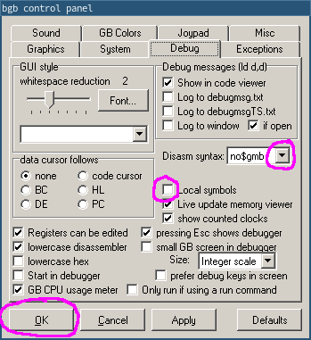

# Tracing

Ever dreamed of being a wizard?
Well, this won't give you magical powers, but let's see how emulators can be used to control time!

First, make sure to focus the debugger window.
Let's first explain the debugger's layout:

Top-left is the code viewer, bottom-left is the data viewer, top-right are some registers (as we saw in [the registers lesson](registers.html)), and bottom-right is the stack viewer.
What's the stack?
We will answer that question a bit later... in Part Ⅱ 😅

## Setup

For now, let's focus on the code viewer.
If you focus the debugger while the emulator is running, it will pause, as indicated by the screen window's title changing to `bgb (debugging)`.

Okay, but what's with this weird syntax?
Well, there are several syntaxes for Game Boy assembly, and BGB doesn't use RGBDS' by default.
We can fix that in the options, which we can access by either:
- Right-clicking the screen and selecting "Options"
- In the debugger, open the "Window" menu, and select "Options"
- Press <kbd><kbd>F11</kbd></kbd> while focusing either the screen or debugger

BGB has a *ton* of options, but don't worry, it's got good defaults, so we don't need to look at most of them for now.
Select the "Debug" tab, and set "Disasm syntax" to "rgbds".
Oh, and check the "Local symbols" box, too.
Now, click "OK" to apply the options.



::: warning

You can also customize a lot of key bindings in the options, but I will stick to the default ones for this tutorial for the sake of simplicity.

:::

Alright, great!
But where are the labels?
Well, as we have seen a couple of lessons ago, labels are merely a convenience provided by RGBASM, but they are not part of the ROM itself.
It is very much inconvenient to debug without them, and so sym files (for "**sym**bols") have been developed.
Let's run RGBLINK to generate a sym file for our ROM:

```console
$ rgblink -n hello-world.sym hello-world.o
```

::: warning:‼️

The file names matter!
When looking for a ROM's sym file, BGB takes the ROM's file name, strips the extension (here, `.gb`), replaces it with `.sym`, and looks for a file **in the same directory** with that name.

:::

Then, in the debugger, we can go in the "File" menu and select "reload SYM file".


Much better!

::: tip:🔍

If a sym file is loaded, pressing <kbd><kbd>Tab</kbd></kbd> allows toggling whether labels are displayed or not.

:::

## Stepping

When pausing execution, the debugger will automatically focus on the instruction the CPU is about to execute, as indicated by the line highlighted in blue.


::: tip:ℹ️

The instruction highlighted in blue is always what the CPU is *about to execute*, not what it *just executed*. Keep this in mind.

:::

If we want to watch execution from the beginning, we need to reset the emulator.
Go into the debugger's "Run" menu, and select "Reset", or tap your numpad's <kbd><kbd>\*</kbd></kbd> key.

The blue line should automatically move to address $0100[^boot_addr], and now we're ready to trace!
All the commands for that are in the "Run" menu.

- "Run" simply unpauses the emulator. Clicking on the screen also does the same.
- "Trace" (more commonly known as "Step Into") and "Step Over" advance the emulator by one instruction.
They only really differ on the `call` instruction and interrupts, neither of which we are using here, so we will use "Trace".
- The other options are not relevant for now.

We will have to "Trace" a bunch of times, so it's a good idea to use the key shortcut.
If we press <kbd><kbd>F7</kbd></kbd> once, the `jp EntryPoint` is executed.
And if we press it a few more times, can see the instructions being executed, one by one!

<video controls poster="../assets/vid/reset_trace.poster.png">
  <source src="../assets/vid/reset_trace.webm" type="video/webm">
  <source src="../assets/vid/reset_trace.mp4" type="video/mp4">

  
</video>

Now, you may notice the `WaitVBlank` loop runs a *lot* of times, but what we are interested in is the `CopyTiles` loop.
We can easily skip over it in several ways; this time, we will use a *breakpoint*.
We will place the breakpoint on the `ld de, Tiles` at `00:0162`; either double-click on that line, or select it and press <kbd><kbd>F2</kbd></kbd>.
The line will turn red:


Then you can resume execution either by clicking the screen or pressing <kbd><kbd>F9</kbd></kbd>, and BGB will automatically pause.
Whenever BGB is running, and the (emulated) CPU is about to execute an instruction a breakpoint was placed on, it automatically pauses.


You can see where execution is being paused both from the green arrow and the value of PC.

If we trace the next three instructions, we can see the three arguments to the `CopyTiles` loop getting loaded into registers.


For fun, let's watch the tiles as they're being copied.
For that, obviously, we will use the data viewer, and position it at the destination.
As we can see from the image above, that would be $9000!

Select the data viewer (either click somewhere in it, or use <kbd><kbd>Ctrl</kbd>+<kbd>Tab</kbd></kbd> to switch focus, as indicated by the grey bar on the left), and press Ctrl+G (for "Goto").
In the popup, type the address you wish to go to, in our case `9000` (sans dollar sign!!).

<video controls poster="../assets/vid/trace_copy.poster.png">
  <source src="../assets/vid/trace_copy.webm" type="video/webm">
  <source src="../assets/vid/trace_copy.mp4" type="video/mp4">

  
</video>

Awesome, right?

## What next?

Congrats, you have just learned how to use a debugger!
We have only scratched the surface, though; we will use more of BGB's tools to illustrate the next parts.
Don't worry, from here on, lessons will go with a lot more images—you've made it through the hardest part!

---

[^boot_addr]:
Why does execution start at $0100?
That's because it's where the [boot ROM](https://gbdev.io/pandocs/Power_Up_Sequence) hands off control to our game once it's done.
