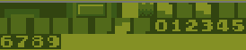
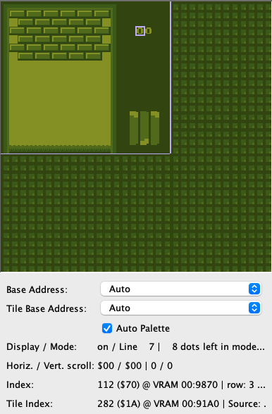

# Decimal Numbers

Now that we can make the bricks disappear on impact, we should probably get some reward, like points!
We'll start off with a score of 0 and then increase the score by 1 point each time a brick gets destroyed.
Then we can display the score on a scoreboard.

## BCD

As we're stingy when it comes to memory use, we will only use one byte. There are different ways of saving and retrieving numbers as decimals, but this time we will choose something called "Packed Binary Coded Decimal" or packed BCD for short.

BCD is a way of storing decimal numbers in bytes, not using A-F, so $A would be 10 which consists of the digits 1 and 0.

Remember how bits, nibbles and bytes work? Go and have a look at the [Hexadeciamal](../part1/bin_and_hex.md) section if you need a reminder.

The "packed" part means that we pack 2 digits into one byte. A byte contains 8 bits and inside 4 bits we can already store numbers between `$0` (`%0000`) and `$F` (`%1111`), which is more than sufficent to store a number between 0 and 9.

For example the number 35 (my favorite Pokémon) contains the number 3 `%0011` and 5 `%0101` and as a packed BCD this is `%00110101`

## Calculating the score

Now let's start by defining a global variable (memory location) for the score:

```rgbasm,linenos,start={{#line_no_of "" ../../unbricked/bcd/main.asm:score-variable}}
{{#include ../../unbricked/bcd/main.asm:score-variable}}
```

And we'll set this to zero when initializing the other global variables.

```rgbasm,linenos,start={{#line_no_of "" ../../unbricked/bcd/main.asm:init-variables}}
{{#include ../../unbricked/bcd/main.asm:init-variables}}
```

Now we'll write a function to increase the score, right behind the `IsWallTile` function.
Don't worry about the call to `UpdateScoreBoard`, we'll get into that in a bit.

```rgbasm,linenos,start={{#line_no_of "" ../../unbricked/bcd/main.asm:increase-score}}
{{#include ../../unbricked/bcd/main.asm:increase-score}}
```

Let's have a look at what's going on there:
We set A to 1 and clear the carry flag
We add the score variable (contents of memory location `wScore`) to a, so now A has our increased score.

So far so good, but what if the score was 9 and we add 1? The processor thinks in binary only and will do the following math:

`%00001001` + `%00000001` = `%00001010` = `$A`

That's a hexadecimal representation of 10, and we need to adjust it to become decimal. `DAA` or "Decimal Adjust after Addition," does just that.
After executing `DAA` our accumulator will be adjusted from `%00001010` to `%00010000`; a 1 in the left nibble and a 0 in the right one. A more detailed article about `DAA` on the Game Boy can be found [here](https://blog.ollien.com/posts/gb-daa/).

Then we store the score back into `wScore` and finally, we call a function that will update the score board, which we will implement next.

Of course, we still need to call it on impact. To do this, we add a call to `IncreaseScorePackedBCD` after each collision handler (we had a left and a right collision) in `CheckAndHandleBrick`

```rgbasm,linenos,start={{#line_no_of "" ../../unbricked/bcd/main.asm:check-for-brick}}
{{#include ../../unbricked/bcd/main.asm:check-for-brick}}
```

## Digit tiles

Before we can display the score we'll need to add some graphics for the numbers 0-9. We already have some ready-made digits for this project, so you can copy [this premade file](https://github.com/gbdev/gb-asm-tutorial/raw/master/unbricked/bcd/digit-tileset.asm), and paste it at the end of your tile set, just before the `TilesEnd` label. Your tile set will look like this:



So we can easily remember where the digits start, let's add a constant called `DIGIT_OFFSET` to point us to where the digits are relative to the start of the tile set: `$1A`

```rgbasm,linenos,start={{#line_no_of "" ../../unbricked/bcd/main.asm:digit-offset}}
{{#include ../../unbricked/bcd/main.asm:digit-offset}}
```

Let's make an assumption, that we cannot get a score higher than 99 ([what could possibly go wrong](https://en.wikipedia.org/wiki/Year_2000_problem)) so two digits are enough.

We can start with showing two zeroes (the tile at offset `$1A`) on our initial map. Let's put them on row 3, starting 4 tiles to the left.
You can copy-paste the tile set from [this file](https://github.com/gbdev/gb-asm-tutorial/raw/master/unbricked/bcd/tilemap.asm)

This should make the tile set look like this on start up:



> **Tip:** You can find the address in VRAM in your emulator's tile map viewer by selecting the tile and looking at the index.
> The screenshot above is from emulucious.

Let's remember their positions by defining a constant for VRAM location of the 10s and the 1s at the top of our file, behind the other constants.

```rgbasm,linenos,start={{#line_no_of "" ../../unbricked/bcd/main.asm:score-tile-location}}
{{#include ../../unbricked/bcd/main.asm:score-tile-location}}
```
## Displaying the score

Now we need to write the missing `UpdateScoreBoard` function that will update the score board:

```rgbasm,linenos,start={{#line_no_of "" ../../unbricked/bcd/main.asm:update-score-board}}
{{#include ../../unbricked/bcd/main.asm:update-score-board}}
```

First we load the score (stored in the wScore memory location) into register A. Recall that the score is stored in packed BCD format, where the upper nibble contains the tens digit and the lower nibble contains the ones digit.

The `and %11110000` operation masks the lower nibble (the ones digit) so that only the upper nibble (the tens digit) remains in `A`.

The `rrca` instructions perform a rotate right operation on `A` four times. This effectively shifts the tens digit to the lower nibble, making it ready to map to a digit tile.

We then add the `DIGIT_OFFSET` constant to the tens digit to calculate the tile address for the digit. This address is stored in the `SCORE_TENS` VRAM location, which updates the display to show the tens digit.

Finally, we repeat the process for the ones digit: We mask the tens digit from `A` using `and %00001111`, no need to rotate this time.

Now we can display the score on the screen! We'll need to call `UpdateScoreBoard` after each time the score is updated. We've already done this in the `IncreaseScorePackedBCD` function, so we're all set!