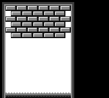
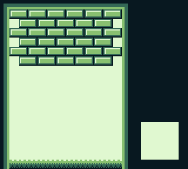
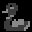

# Getting started

In this lesson, we will start a new project from scratch.
We will make a [Breakout](https://en.wikipedia.org/wiki/Breakout_%28video_game%29) / [Arkanoid](https://en.wikipedia.org/wiki/Arkanoid) clone, which we'll call "Unbricked"!
(Though you are free to give it any other name you like, as it will be *your* project.)

Open a terminal and make a new directory (`mkdir unbricked`), and then enter it (`cd unbricked`), just like you did for ["Hello, world!"](../part1/hello_world.md).

Start by creating a file called `main.asm`, and include `hardware.inc` in your code.

```rgbasm,linenos,start={{#line_no_of "" ../../unbricked/getting-started/main.asm:includes}}
{{#include ../../unbricked/getting-started/main.asm:includes}}
```
You may be wondering what purpose `hardware.inc` serves.
Well, the code we write only really affects the CPU, but does not do anything with the rest of the console (not directly, anyway).
To interact with other components (like the graphics system, say), [Memory-Mapped <abbr title="Input/Output">I/O</abbr>](https://en.wikipedia.org/wiki/Memory-mapped_I/O) (MMIO) is used: basically, [memory](../part1/memory.md) in a certain range (addresses $FF00–FF7F) does special things when accessed.

These bytes of memory being interfaces to the hardware, they are called *hardware registers* (not to be mistaken with [the CPU registers](../part1/registers.md)).
For example, the "PPU status" register is located at address $FF41.
Reading from that address reports various bits of info regarding the graphics system, and writing to it allows changing some parameters.
But, having to remember all the numbers ([non-exhaustive list](https://gbdev.io/pandocs/Power_Up_Sequence.html#hardware-registers)) would be very tedious—and this is where `hardware.inc` comes into play!
`hardware.inc` defines one constant for each of these registers (for example, `rSTAT` for the aforementioned "PPU status" register), plus some additional constants for values read from or written to these registers.

:::tip

Don't worry if this flew over your head, we'll see an example below with `rLCDC` and `LCDCF_ON`.

By the way, the `r` stands for "register", and the `F` in `LCDCF` stands for "flag".

:::

Next, make room for the header.
[Remember from Part Ⅰ](../part1/header.md) that the header is where some information that the Game Boy relies on is stored, so you don't want to accidentally leave it out.

```rgbasm,linenos,start={{#line_no_of "" ../../unbricked/getting-started/main.asm:header}}
{{#include ../../unbricked/getting-started/main.asm:header}}
```

The header jumps to `EntryPoint`, so let's write that now:

```rgbasm,linenos,start={{#line_no_of "" ../../unbricked/getting-started/main.asm:entry}}
{{#include ../../unbricked/getting-started/main.asm:entry}}
```

The next few lines wait until "VBlank", which is the only time you can safely turn off the screen (doing so at the wrong time could damage a real Game Boy, so this is very crucial).
We'll explain what VBlank is and talk about it more later in the tutorial.

Turning off the screen is important because loading new tiles while the screen is on is tricky—we'll touch on how to do that in Part 3.

Speaking of tiles, we're going to load some into VRAM next, using the following code:

```rgbasm,linenos,start={{#line_no_of "" ../../unbricked/getting-started/main.asm:copy_tiles}}
{{#include ../../unbricked/getting-started/main.asm:copy_tiles}}
```

This loop might be [reminiscent of part Ⅰ](../part1/jumps.md#conditional-jumps).
It copies starting at `Tiles` to `$9000` onwards, which is the part of VRAM where our [tiles](../part1/tiles.md) are going to be stored.
Recall that `$9000` is where the data of background tile $00 lies, and the data of subsequent tiles follows right after.
To get the number of bytes to copy, we will do just like in Part Ⅰ: using another label at the end, called `TilesEnd`, the difference between it (= the address after the last byte of tile data) and `Tiles` (= the address of the first byte) will be exactly that length.

That said, we haven't written `Tiles` nor any of the related data yet.
We'll get to that later!

Almost done now—next, write another loop, this time for copying [the tilemap](../part1/tilemap.md).

```rgbasm,linenos,start={{#line_no_of "" ../../unbricked/getting-started/main.asm:copy_map}}
{{#include ../../unbricked/getting-started/main.asm:copy_map}}
```

Note that while this loop's body is exactly the same as `CopyTiles`'s, the 3 values loaded into `de`, `hl`, and `bc` are different.
These determine the source, destination, and size of the copy, respectively.

:::tip "Don't Repeat Yourself"

If you think that this is super redundant, you are not wrong, and we will see later how to write actual, reusable *functions*.
But there is more to them than meets the eye, so we will start tackling them much later.

:::

Finally, let's turn the screen back on, and set a [background palette](../part1/palettes.md).
Rather than writing the non-descript number `%10000001` (or $81 or 129, to taste), we make use of two constants graciously provided by `hardware.inc`: `LCDCF_ON` and `LCDCF_BGON`.
When written to [`rLCDC`](https://gbdev.io/pandocs/LCDC), the former causes the PPU and screen to turn back on, and the latter enables the background to be drawn.
(There are other elements that could be drawn, but we are not enabling them yet.)
Combining these constants must be done using `|`, the *binary "or"* operator; we'll see why later.

```rgbasm,linenos,start={{#line_no_of "" ../../unbricked/getting-started/main.asm:end}}
{{#include ../../unbricked/getting-started/main.asm:end}}
```

There's one last thing we need before we can build the ROM, and that's the graphics.
We will draw the following screen:



In `hello-world.asm`, tile data had been written out by hand in hexadecimal; this was to let you see how the sausage is made at the lowest level, but *boy* is it impractical to write!
This time, we will employ a more friendly way, which will let us write each row of pixels more easily.
For each row of pixels, instead of writing [the bitplanes](../part1/tiles.md#encoding) directly, we will use a backtick (`` ` ``) followed by 8 characters.
Each character defines a single pixel, intuitively from left to right; it must be one of 0, 1, 2, and 3, representing the corresponding color index in [the palette](../part1/palettes.md).

:::tip

If the character selection isn't to your liking, you can use [RGBASM's `-g` option](https://rgbds.gbdev.io/docs/v0.5.2/rgbasm.1#g) or [`OPT g`](https://rgbds.gbdev.io/docs/v0.5.2/rgbasm.5/#Changing_options_while_assembling) to pick others.
For example, `rgbasm -g '.xXO' (...)` or `OPT g.xXO` would swap the four characters to `.`, `x`, `X`, and `O` respectively.

:::

For example:

```rgbasm
	dw `01230123 ; This is equivalent to `db $55,$33`
```

You may have noticed that we are using `dw` instead of `db`; the difference between these two will be explained later.
We already have tiles made for this project, so you can copy [this premade file](https://github.com/gbdev/gb-asm-tutorial/raw/master/unbricked/getting-started/tileset.asm), and paste it at the end of your code.

Then copy the tilemap from [this file](https://github.com/gbdev/gb-asm-tutorial/raw/master/unbricked/getting-started/tilemap.asm), and paste it after the `TilesEnd` label.

You can build the ROM now, by running the following commands in your terminal:

```console
$ rgbasm -o main.o main.asm
$ rgblink -o unbricked.gb main.o
$ rgbfix -v -p 0xFF unbricked.gb
```

If you run this in your emulator, you should see the following:



That white square seems to be missing!
You may have noticed this comment earlier, somewhere in the tile data:

```rgbasm,linenos,start={{#line_no_of "" ../../unbricked/getting-started/main.asm:custom_logo}}
{{#include ../../unbricked/getting-started/main.asm:custom_logo}}
```

The logo tiles were left intentionally blank so that you can choose your own.
You can use one of the following pre-made logos, or try coming up with your own!

- **RGBDS Logo**

  

  [Source](https://github.com/gbdev/gb-asm-tutorial/raw/master/unbricked/getting-started/rgbds.asm)

- **Duck**

  

  [Source](https://github.com/gbdev/gb-asm-tutorial/raw/master/unbricked/getting-started/duck.asm)

- **Tail**

  

  [Source](https://github.com/gbdev/gb-asm-tutorial/raw/master/unbricked/getting-started/tail.asm)

Add your chosen logo's data (click one of the "Source" links above) after the comment, build the game again, and you should see your logo of choice in the bottom-right!
