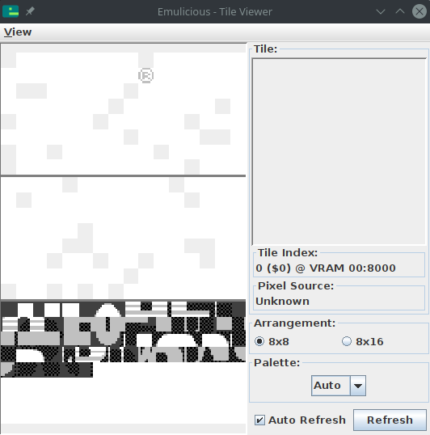

# Objects

The background is very useful when the whole screen should move at once, but this is not ideal for everything.
For example, a cursor in a menu, NPCs and the player in a RPG, bullets in a shmup, or balls in an *Arkanoid* clone... all need to move independently of the background.
Thankfully, the Game Boy has a feature that's perfect for these!
In this lesson, we will talk about *objects* (sometimes called "OBJ").

:::tip

The above description may have made you think of the term "sprite" instead of "object".
The term "sprite" has a *lot* of meanings depending on context, so, to avoid confusion, this tutorial tries to use specific alternatives instead, such as *object*, *metasprite*, *actor*, etc.

:::

Each object allows drawing one or two tiles (so 8×8 or 8×16 pixels, respectively) at any on-screen position—unlike the background, where all the tiles are drawn in a grid.
Therefore, an object consists of its on-screen position, a tile ID (like [with the tilemap](../part1/tilemap.md)), and some extra properties called "attributes".
These extra properties allow, for example, to display the tile flipped.
We'll see more about them later.

Just like how the tilemap is stored in VRAM, objects live in a region of memory called OAM, meaning **Object Attribute Memory**.
Recall from above that an object consists of:
- Its on-screen position
- A tile ID
- The "attributes"

These are stored in 4 bytes: one for the Y coordinate, one for the X coordinate, one for the tile ID, and one for the attributes.
OAM is 160 bytes long, and since 160 ∕ 4 = 40, the Game Boy stores a total of **40** objects at any given time.

There is a catch, though: an object's Y and X coordinate bytes in OAM do *not* store its on-screen position!
Instead, the *on-screen* X position is the *stored* X position **minus 8**, and the *on-screen* Y position is the *stored* Y position **minus 16**.
To stop displaying an object, we can simply put it off-screen, e.g. by setting its Y position to 0.

:::tip

These offsets are not arbitrary!
Consider an object's maximum size: 8 by 16 pixels.
These offsets allow objects to be clipped by the left and top edges of the screen.
The NES, for example, lacks such offsets, so you will notice that objects always disappear after hitting the left or top edge of the screen.

:::

Let's discover objects by experimenting with them!

First off, when the Game Boy is powered on, OAM is filled with a bunch of semi-random values, which may cover the screen with some random garbage.
Let's fix that by first clearing OAM before enabling objects for the first time.
Let's add the following just after the `CopyTilemap` loop:

```rgbasm,linenos,start={{#line_no_of "" ../../unbricked/objects/main.asm:clear-oam}}
{{#include ../../unbricked/objects/main.asm:clear-oam}}
```

This is a good time to do that, since just like VRAM, the screen must be off to safely access OAM.

Once OAM is clear, we can draw an object by writing its properties.

```rgbasm,linenos,start={{#line_no_of "" ../../unbricked/objects/main.asm:init-object}}
{{#include ../../unbricked/objects/main.asm:init-object}}
```

Remember that each object in OAM is 4 bytes, in the order Y, X, Tile ID, Attributes.
So, the object's top-left pixel lies 128 pixels from the top of the screen, and 16 from its left.
The tile ID and attributes are both set to 0.

You may remember from the previous lesson that we're already using tile ID 0, as it's the start of our background's graphics.
However, by default objects and backgrounds use a different set of tiles, at least for the first 128 IDs.
Tiles with IDs 128–255 are shared by both, which is useful if you have a tile that's used both on the background and by an object.

If you go to "Tools", then "Tile Viewer" in Emulicious' debugger, you should see three distinct sections.



Because we need to load this to a different area, we'll use the address $8000 and load a graphic for our game's paddle.
Let's do so right after `CopyTilemap`:

```rgbasm,linenos,start={{#line_no_of "" ../../unbricked/objects/main.asm:copy-paddle}}
{{#include ../../unbricked/objects/main.asm:copy-paddle}}
```

And don't forget to add `Paddle` to the bottom of your code.

```rgbasm
{{#include ../../unbricked/objects/main.asm:paddle-gfx}}
```

Finally, let's enable objects and see the result.
Objects must be enabled by the familiar `rLCDC` register, otherwise they just don't show up.
(This is why we didn't have to clear OAM in the previous lessons.)
We will also need to initialize one of the object palettes, `rOBP0`.
There are actually two object palettes, but we're only going to use one.

```rgbasm,linenos,start={{#line_no_of "" ../../unbricked/objects/main.asm:enable-oam}}
{{#include ../../unbricked/objects/main.asm:enable-oam}}
```

## Movement

Now that you have an object on the screen, let's move it around.
Previously, the `Done` loop did nothing; let's rename it to `Main` and use it to move our object.
We're going to wait for VBlank before changing OAM, just like we did before turning off the screen.

```rgbasm,linenos,start={{#line_no_of "^Main:" ../../unbricked/objects/main.asm}}
Main:
    ; Wait until it's *not* VBlank
    ld a, [rLY]
    cp 144
    jp nc, Main
WaitVBlank2:
	ld a, [rLY]
	cp 144
	jp c, WaitVBlank2

	; Move the paddle one pixel to the right.
	ld a, [_OAMRAM + 1]
	inc a
	ld [_OAMRAM + 1], a
	jp Main
```

:::tip:🤨

Here, we are accessing OAM without turning the LCD off, but it's still safe.
Explaining why requires a more thorough explanation of the Game Boy's rendering, so let's ignore it for now.

:::

Now you should see the paddle moving... very quickly.
Because it moves by a pixel every frame, it's going at a speed of 60 pixels per second!
To slow this down, we'll use a *variable*.

So far, we have only worked with the CPU registers, but you can create global variables too!
To do this, let's create another section, but putting it in `WRAM0` instead of `ROM0`.
Unlike ROM ("Read-Only Memory"), RAM ("Random-Access Memory") can be written to; thus, WRAM, or Work RAM, is where we can store our game's variables.

Add this to the bottom of your file:

```rgbasm,linenos,start={{#line_no_of "" ../../unbricked/objects/main.asm:variables}}
{{#include ../../unbricked/objects/main.asm:variables}}
```

Now we'll use the `wFrameCounter` variable to count how many frames have passed since we last moved the paddle.
Every 15th frame, we'll move the paddle by one pixel, slowing it down to 4 pixels per second.
Don't forget that RAM is filled with garbage values when the Game Boy starts, so we need to initialize our variables before first using them.

```rgbasm,linenos,start={{#line_no_of "" ../../unbricked/objects/main.asm:main-loop}}
{{#include ../../unbricked/objects/main.asm:main-loop}}
```

Alright!
Up next is us taking control of that little paddle.
