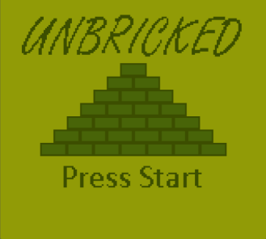

# Title Screen

Let's make our game more official and give it a title screen! First, copy the tileset and tilemap found [here](https://github.com/gbdev/gb-asm-tutorial/raw/master/unbricked/title-screen/tilemap-titlescreen.asm) and paste it at the end of your code. This will make a title screen that looks like so: 



Then copy and paste the following after [waiting for VBlank](./getting-started.md):

```rgbasm,linenos,start={{#line_no_of "" ../../unbricked/title-screen/main.asm:title_screen}}
{{#include ../../unbricked/title-screen/main.asm:title_screen}}
```
Note that we are using our `Memcopy` function from the [Functions](./functions.md) lesson! Isn't it handy to have reusable code? We are also using our `UpdateKeys` function from the [Input](./input.md) lesson to determine when to stop displaying the title screen and move on to the game itself. To do so, we loop until the start button has been pressed. 

And just like that we have ourselves a title screen! 
