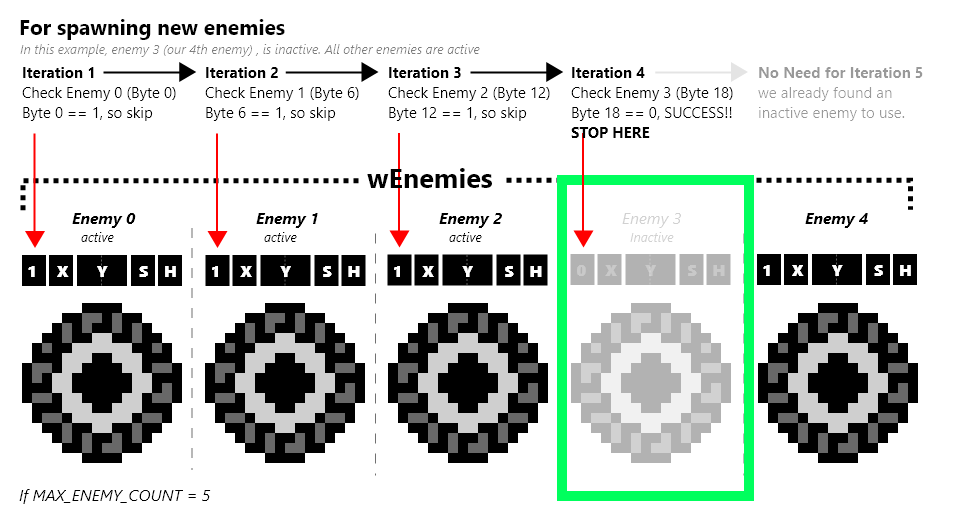

# “Activating” a pooled object

Galactic Armada doesn’t have “arrays” in the normal sense. it uses object pools of a fixed size. Activate a pooled object, we simply loop through each object. If the first byte, which tells us if it’s active or not, is 0: then we’ll add the new item at that location and set that byte to be 1. If we loop through all possible objects and nothing is inactive, nothing happens.

