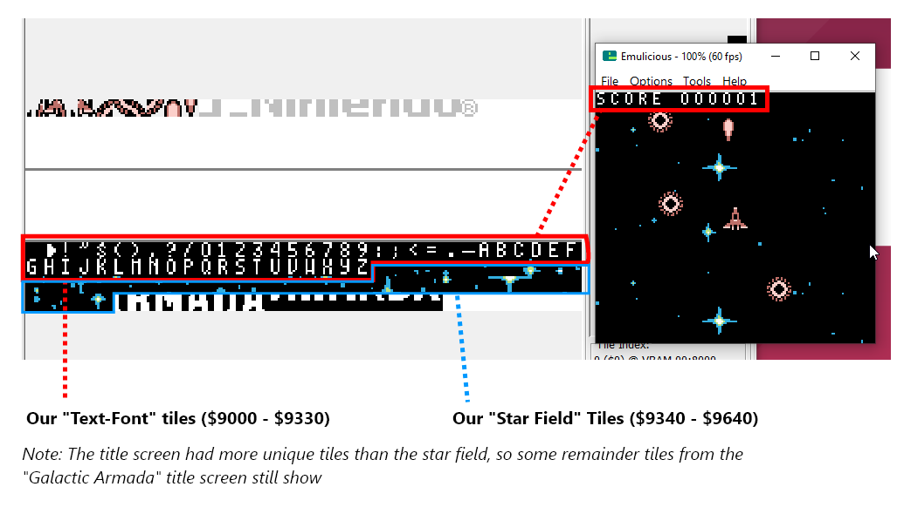

## Entry Point

We'll start this tutorial out like the previous, with our "header" section (at address: $100). We're also going to declare some global variables that will be used throughout the game.

- `wLastKeys` and `wCurKeys` are used for joypad input
- `wGameState` will keep track what our current game state is

```rgbasm,linenos,start={{#line_no_of "" ../../galactic-armada/src/main/GalacticArmada.asm:entry-point}}
{{#include ../../galactic-armada/src/main/GalacticArmada.asm:entry-point}}
```

after our `EntryPoint` label, well do the following:

- set our default game state
- initiate [gb-sprobj-lib](https://github.com/eievui5/gb-sprobj-lib), the sprite library we're going to use
- setup our display registers
- load tile data for our font into VRAM.

The tile data we are going to load is used by all game states, which is why we'll do it here & now, for them all to use.


This character-set is called “Area51”. It, and more 8x8 pixel fonts can ne found here: [https://damieng.com/typography/zx-origins/](https://damieng.com/typography/zx-origins/) . These 52 tiles will be placed at the beginning of our background/window VRAM region.



One important thing to note. Character maps for each letter must be defined. This let’s RGBDS know what byte value to give a specific letter.

For the Galactic Armada space mapping, we’re going off the “text-font.png” image. Our space character is the first character in VRAM. Our alphabet starts at 26. Special additions could be added if desired. For now, this is all that we’ll need. We'll define that map in "src/main/utils/macros/text-macros.inc".

```rgbasm,linenos,start={{#line_no_of "" ../../galactic-armada/src/main/utils/macros/text-macros.inc:charmap}}
{{#include ../../galactic-armada/src/main/utils/macros/text-macros.inc:charmap}}
```

Getting back to our entry point. Were going to wait until a vertical blank begins to do all of this. We'll also turn the LCD off before loading our tile data into VRAM..

```rgbasm,linenos,start={{#line_no_of "" ../../galactic-armada/src/main/GalacticArmada.asm:entry-point-end}}
{{#include ../../galactic-armada/src/main/GalacticArmada.asm:entry-point-end}}
```

:::tip

Even though we haven't specifically defined a color palette. The [emulicious](https://emulicious.net/) emulator may automatically apply a default color palette if in "Automatic" or "Gameboy Color" mode.

:::

:::tip

Instead of `ld a, 0`, we can use `xor a` to set `a` to 0. It takes one byte less, which matters a lot on the Game Boy.

:::

In the above snippet you saw use of a function called `WaitFOrOneVBLank`. We've setup some vblank utility functions in the "src/main/utils/vblank-utils.asm" file:

```rgbasm,linenos,start={{#line_no_of "" ../../galactic-armada/src/main/utils/vblank-utils.asm:vblank-utils}}
{{#include ../../galactic-armada/src/main/utils/vblank-utils.asm:vblank-utils}}
```

In the next section, we'll go on next to setup our `NextGameState` label. Which is used for changing game states.
