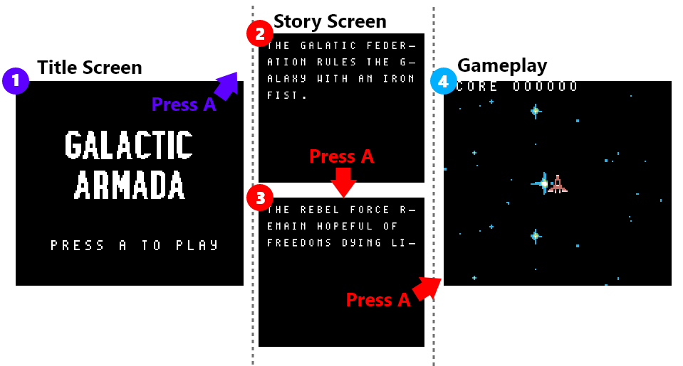

# Game States

Galactic armada comes with 3 basic game states. A title screen, a story screen, and gameplay. Each game state has different logic and are separated into their own folders. Each state has the responsibility to 

- Initiate itself
- Turn the LCD screen back on after initiating (turned off before initiating each game state)
- Poll for input
- Wait or VBlank phases
- Provide most of it’s own logic.

The default game state is the title screen.



## Common Tile Data

All the game states utilize the tiles from the “text-font.png” image. This is a basic alphanumeric set of characters.


 This character-set is called “Area51”. It, and more 8x8 pixel fonts can ne found here: [https://damieng.com/typography/zx-origins/](https://damieng.com/typography/zx-origins/) . These 52 tiles will be placed at the beginning of our background/window VRAM region.  


Because they are shared, we’ll put them in VRAM at the start and not touch them.

```rgbasm,linenos,start={{#line_no_of "" ../../galactic-armada/main.asm:load-text-font}}
{{#include ../../galactic-armada/main.asm:load-text-font}}
```

Because of this, our background tilemaps  will be need to use a offset of 52 tiles. Each tile is 16 bytes, so tile data also needs to start at $9440. Here’s an example for the title screen.

```rgbasm,linenos,start={{#line_no_of "" ../../galactic-armada/main.asm:draw-title-screen}}
{{#include ../../galactic-armada/main.asm:draw-title-screen}}
```
