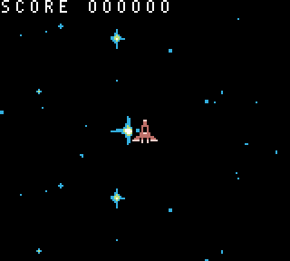

# Gameplay State

Gameplay is the core chunk of the source code. It also took the most time to create. In this game state, the player will control a spaceship. Flying over a vertically scrolling space background. They’ll be able to freely move in 4 directions , and shoot oncoming alien ships. As alien ships are destroyed by bullets, the player’s score will increase.

