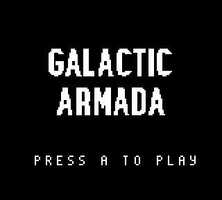

# Introducing Galactic Armada

This guide will help you create a classic shoot-em-up in RGBDS. This guide builds on knowledge from the previous tutorials, so some basic (or previously explained) concepts will not be explained.

## Feature set

Here's a list of features that will be included in the final product.

- Vertical Scrolling Background
- Basic HUD (via Window) & Score
- 4-Directional Player Movement
- Enemies
- Bullets
- Enemy/Bullet Collision
- Enemy/Player Collision
- Smooth Movement via Scaled Integers - Instead of using counters, smoother motion can be achieved using 16-bit (scaled) integers.
- Multiple Game States: Title Screen, Gameplay, Story State
- STAT Interrupts - used to properly draw the HUD at the top of gameplay.
- RGBGFX & INCBIN
- Writing Text
