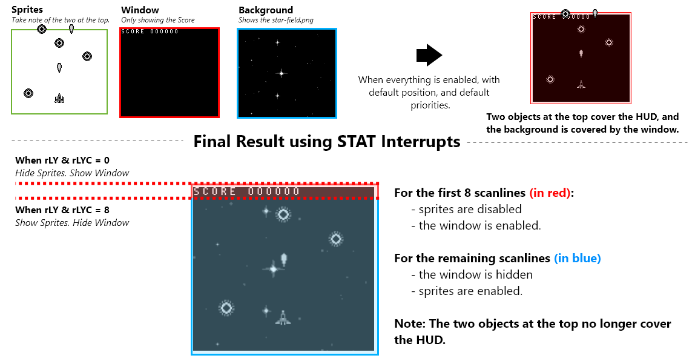
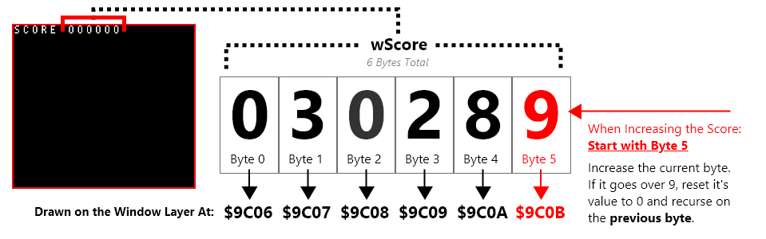

# Heads Up Interface

The gameboy normally draws sprites over both the window and background, and the window over the background. In Galactic Armada, The background is vertically scrolling. This means the HUD (the score text and number) needs to be draw on the window, which is separate from the background. 

On our HUD, we'll draw both our score and our lives. We'll also use STAT interrupts to make sure nothing covers the HUD.

## STAT Interrupts & the window


The window is not enabled by default. We can enable the window using the `LCDC` register. RGBDS comes with constants that will help us. 

> ⚠️ NOTE: The window can essentially be a copy of the background. The `LCDCF_WIN9C00|LCDCF_BG9800` portion makes the background and window use different tilemaps when drawn.
There’s only one problem. Since the window is drawn between sprites and the background. Without any extra effort, our scrolling background tilemap will be covered by our window. In addition, our sprites will be drawn over our hud. For this, we’ll need STAT interrupts. Fore more information on STAT interrupts, check out the pandocs: [https://gbdev.io/pandocs/Interrupt_Sources.html](https://gbdev.io/pandocs/Interrupt_Sources.html)




> ### **[Using the STAT interrupt](https://gbdev.io/pandocs/Interrupt_Sources.html#using-the-stat-interrupt)**
> 
> One very popular use is to indicate to the user when the video hardware is about to redraw a given LCD line. This can be useful for dynamically controlling the SCX/SCY registers ($FF43/$FF42) to [perform special video effects](https://github.com/gb-archive/DeadCScroll).
> 
> Example application: set LYC to WY, enable LY=LYC interrupt, and have the handler disable sprites. This can be used if you use the window for a text box (at the bottom of the screen), and you want sprites to be hidden by the text box.


With STAT interrupts, we can implement raster effects. in our case, we’ll enable the window and stop drawing sprites on the first 8 scanlines. Afterwards, we’ll show sprites and disable the window layer for the remaining scanlines. This makes sure nothing overlaps our HUD, and that our background is fully shown also.

### Initiating & Disabling STAT interrupts

In our gameplay game state, at different points in time, we initialized and disabled interrupts. Here's the logic for those functions in our "src/main/states/gameplay/hud.asm" file:

```rgbasm,linenos,start={{#line_no_of "" ../../galactic-armada/src/main/states/gameplay/interrupts.asm:interrupts-start}}
{{#include ../../galactic-armada/src/main/states/gameplay/interrupts.asm:interrupts-start}}
```

### Defining STAT interrupts

Our actual STAT interrupts must be located at $0048. We'll define different paths depending on what our LYC variable's value is when executed.

```rgbasm,linenos,start={{#line_no_of "" ../../galactic-armada/src/main/states/gameplay/interrupts.asm:interrupts-section}}
{{#include ../../galactic-armada/src/main/states/gameplay/interrupts.asm:interrupts-section}}
```

That should be all it takes to get a properly drawn HUD. For more details, check out the code in the repo or [ask questions](https://gbdev.io/gb-asm-tutorial/help-feedback.html) on the gbdev discord server.

## Keeping Score and Drawing Score on the HUD

To keep things simple, back in our gameplay game state, we used 6 different bytes to hold our score.Each byte will hold a value between 0 and 9, and represents a specific digit in the score. So it’s easy to loop through and edit the score number on the HUD: The First byte represents the left-most digit, and the last byte represents the right-most digit. 



When the score increases, we’ll increase digits on the right. As they go higher than 9, we’ll reset back to 0 and increase the previous byte .


```rgbasm,linenos,start={{#line_no_of "" ../../galactic-armada/src/main/states/gameplay/hud.asm:hud-increase-score}}
{{#include ../../galactic-armada/src/main/states/gameplay/hud.asm:hud-increase-score}}
```


We can call that score whenever a bullet hits an enemy. This function however does not draw our score on the background. We do that the same way we drew text previously:


```rgbasm,linenos,start={{#line_no_of "" ../../galactic-armada/src/main/states/gameplay/hud.asm:hud-draw-score}}
{{#include ../../galactic-armada/src/main/states/gameplay/hud.asm:hud-draw-score}}
```

Because we'll only ever have 3 lives, drawing our lives is much easier. The numeric characters in our text font start at 10, so  we just need to put on the window, our lives plus 10.

```rgbasm,linenos,start={{#line_no_of "" ../../galactic-armada/src/main/states/gameplay/hud.asm:hud-draw-lives}}
{{#include ../../galactic-armada/src/main/states/gameplay/hud.asm:hud-draw-lives}}
```