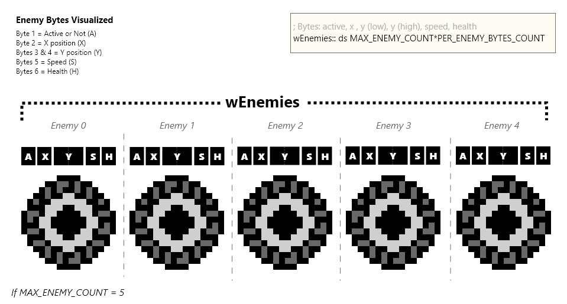
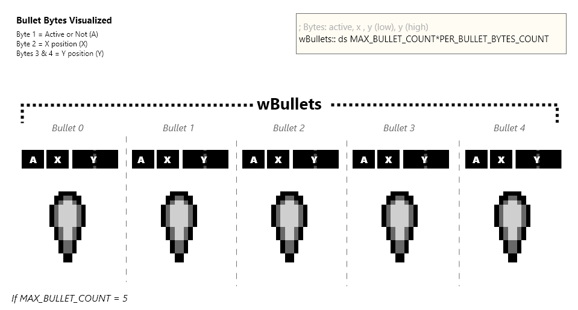

# Object Pools

Galactic Armada will use "object pools" for bullets and enemies. A fixed amount of bytes representing a specific maximum amount of objects. Each pool is just a collection of bytes. The number of bytes per “pool” is the maximum number of objects in the pool, times the number of bytes needed for data for each object.

Constants are also created for the size of each object, and what each byte is. These constants are in the “src/main/utils/constants.inc” file and utilize RGBDS offset constants (a really cool feature)

```rgbasm,linenos,start={{#line_no_of "" ../../galactic-armada/main.asm:bullet-offset-constants}}
{{#include ../../galactic-armada/main.asm:bullet-offset-constants}}
```

The two object types that we need to loop through are Enemies and Bullets.

**Bytes for an Enemy:**

1. Active - Are they active
2. X - Position: horizontal coordinate
3. Y (low) - The lower byte of their 16-bit (scaled) y position
4. Y (high) - The higher byte of their 16-bit (scaled) y position
5. Speed - How fast they move
6. Health - How many bullets they can take

```rgbasm,linenos,start={{#line_no_of "" ../../galactic-armada/main.asm:w-enemies}}
{{#include ../../galactic-armada/main.asm:w-enemies}}
```



**Bytes for a Bullet:**

1. Active - Are they active
2. X - Position: horizontal coordinate
3. Y (low) - The lower byte of their 16-bit (scaled) y position
4. Y (high) - The higher byte of their 16-bit (scaled) y position

```rgbasm,linenos,start={{#line_no_of "" ../../galactic-armada/main.asm:w-bullets}}
{{#include ../../galactic-armada/main.asm:w-bullets}}
```



> ⚠️ **NOTE:** Scaled integers are used for only the y positions of bullets and enemies. Scaled Integers are a way to provide smooth “sub-pixel” movement. They only move vertically, so the x position can be 8-bit.

When looping through an object pool, we’ll check if an object is active. If it’s active, we’ll run the logic for that object. Otherwise, we’ll skip to the start of the next object’s bytes. 

Both bullets and enemies do similar things. They move vertically until they are off the screen. In addition, enemies will check against bullets when updating. If they are found to be colliding, the bullet is destroyed and so is the enemy.

# “Activating” a pooled object

To Activate a pooled object, we simply loop through each object. If the first byte, which tells us if it’s active or not, is 0: then we’ll add the new item at that location and set that byte to be 1. If we loop through all possible objects and nothing is inactive, nothing happens.


