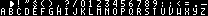

# Project Structure

## Folder Layout

For organizational purposes, many parts of the logic are separated into reusable functions, macros, or into their assembly files. This is to reduce file size, and make logic more clear.

Here’s a basic look at how the project is structured

- libs - Two assembly files for input and sprites are located here.
- src
    - generated - the results of RGBGFX are stored here. **This is not included in the repo**
    - resources - Here exist some PNGs and Aseprite files for usage with RGBGFX
    - main - All assembly files are located here, or in subfolders
- dist - The final ROM file will be created here. **This is not included in the repo**
- obj - Intermediate files from the compile process. **This is not included in the repo**
- Makefile - used to create the final ROM file and intermediate files

## Background & Sprite Resources

The following backgrounds and sprites are used in Galactic Armada:

- Backgrounds
    - Star Field
    - Title Screen
    - Text Font (Tiles only)
- Sprites
    - Enemy Ship
    - Player Ship
    - Bullet





The PNG image used for these files was exported from Aseprite. The original files are included in the repository, but require Aseprite. In the makefile, Those PNGs then are converted into .2bpp and .tilemap files via the RGBDS tool: RGBGFX.  

> The **`rgbgfx`** program converts PNG images into data suitable for display on the Game Boy and Game Boy Color, or vice-versa.
> 
> 
> The main function of **`rgbgfx`** is to divide the input PNG into 8×8 pixel *[squares](https://rgbds.gbdev.io/docs/v0.6.1/rgbgfx.1#squares)*, convert each of those squares into 1bpp or 2bpp tile data, and save all of the tile data in a file. It also has options to generate a tile map, attribute map, and/or palette set as well; more on that and how the conversion process can be tweaked below.
> 

RGBGFX can be found here: [https://rgbds.gbdev.io/docs/v0.6.1/rgbgfx.1](https://rgbds.gbdev.io/docs/v0.6.1/rgbgfx.1)

```bash
# use RGBGFX to create files from pngs
generate-graphics: 
	rgbgfx -c "#FFFFFF,#cfcfcf,#686868,#000000;" --columns 	-o $(GENSPRITES)/player-ship.2bpp 	$(RESSPRITES)/player-ship.png
	rgbgfx -c "#FFFFFF,#cfcfcf,#686868,#000000;" --columns 	-o $(GENSPRITES)/enemy-ship.2bpp 	$(RESSPRITES)/enemy-ship.png
	rgbgfx -c "#FFFFFF,#cfcfcf,#686868,#000000;" --columns 	-o $(GENSPRITES)/bullet.2bpp 		$(RESSPRITES)/bullet.png
	rgbgfx -c "#FFFFFF,#cbcbcb,#414141,#000000;" 			-o $(GENBACKGROUNDS)/text-font.2bpp $(RESBACKGROUNDS)/text-font.png
	rgbgfx -c "#FFFFFF,#cbcbcb,#414141,#000000;" --tilemap $(GENBACKGROUNDS)/star-field.tilemap --unique-tiles -o $(GENBACKGROUNDS)/star-field.2bpp $(RESBACKGROUNDS)/star-field.png
	rgbgfx -c "#FFFFFF,#cbcbcb,#414141,#000000;" --tilemap $(GENBACKGROUNDS)/title-screen.tilemap --unique-tiles  -o $(GENBACKGROUNDS)/title-screen.2bpp $(RESBACKGROUNDS)/title-screen.png
```

From there, INCBIN commands are used to store reference the binary tile data.

```rgbasm,linenos,start={{#line_no_of "" ../../galactic-armada/main.asm:sprite-tile-data}}
{{#include ../../galactic-armada/main.asm:sprite-tile-data}}
```

You can find more about the INCBIN command here: [https://rgbds.gbdev.io/docs/v0.6.1/rgbasm.5#Including_binary_files](https://rgbds.gbdev.io/docs/v0.6.1/rgbasm.5#Including_binary_files)

> 
> 
> 
> ### [Including binary files](https://rgbds.gbdev.io/docs/v0.6.1/rgbasm.5#Including_binary_files)
> 
> You probably have some graphics, level data, etc. you'd like to include. Use **`INCBIN`** to include a raw binary file as it is. If the file isn't found in the current directory, the include-path list passed to [rgbasm(1)](https://rgbds.gbdev.io/docs/v0.6.1/rgbasm.1) (see the **`-i`** option) on the command line will be searched.
> 
> **`INCBIN "titlepic.bin"
> INCBIN "sprites/hero.bin"`**
> 
> You can also include only part of a file with **`INCBIN`**. The example below includes 256 bytes from data.bin, starting from byte 78.
> 
> **`INCBIN "data.bin",78,256`**
> 
> The length argument is optional. If only the start position is specified, the bytes from the start position until the end of the file will be included.
> 

## Compilation

Compilation is done via a Makefile. This makefile can be run using the `make` command. Make should be preinstalled on linux and Mac systems. For windows users, check out Cgyinhere. (TODO)

Without going over everything in detail, here’s what the makefile does:

- Clean generated folders
- Recreate generated folders
- Convert PNGs in src/resources to .2bpp, and .tilemap formats
- Convert .asm files to .o
- Use the .o files to build the ROM file
- Apply the RGBDS “fix” utility for the generated ROM file so everything works fine.

## Entry Point & Game State Management

The game’s entry point is in the GalacticArmada.asm file. This is specified using the following  Section code:

```rgbasm,linenos,start={{#line_no_of "" ../../galactic-armada/main.asm:game-entry-point}}
{{#include ../../galactic-armada/main.asm:game-entry-point}}
```

When the boot ROM finishes, it jumps to address $100, so that's where your game gains control.

The game’s entry point file, GalacticArmada.asm,  purposely doesn’t have much logic into it. You’ll find more logic in each of the game states.

One of the major highlights of the GalacticArmada.asm file is the “**NextGameState**” label. Game states should jump here when changing. Among other things that happen, the next state will be initiated and then it’s own custom update loop will begin. 


```rgbasm,linenos,start={{#line_no_of "" ../../galactic-armada/main.asm:game-states-switch}}
{{#include ../../galactic-armada/main.asm:game-states-switch}}
```

Before each state begins, we’ll do the following:

- clear the background
- clear all sprites
- disable interrupts.
- turn the LCD Off
- clear all sprites
- initialize the BGB and OBP0 display registers

