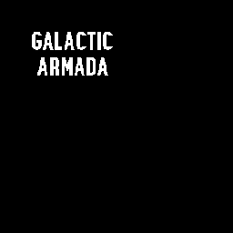

# Sprites & Backgrounds

Drawing backgrounds and populating VRAM with tile data has already been covered in the previous tutorials. To make the code more organized and readable, the code for sprites and backgrounds will already be completed in the starter.

The following backgrounds and sprites are used in Galactic Armada:

- Backgrounds - [Github Link](https://github.com/gbdev/gb-asm-tutorial/tree/master/galactic-armada/src/resources/backgrounds)
  - Star Field
  - Title Screen
  - Text Font (Tiles only)
- Sprites - [Github Link](https://github.com/gbdev/gb-asm-tutorial/tree/master/galactic-armada/src/resources/sprites)
  - Enemy Ship
  - Player Ship
  - Bullet

These images were originally created in Aseprite. The original templates are also included in the repository. 

## The Backgrounds

We have 2 **full** backgrounds. Our Title Screen, and the Star Field for gameplay. 

<br>




<br>

For these 2 backgrounds, we need to use some VRAM space for our text font. This text font will be at the beginning and occupy 52 tiles. For this reason, tilemaps we use later need their values to be offset by 52. That's why you'll see `CopyDEintoMemoryAtHL_With52Offset` used instead of just `CopyDEintoMemoryAtHL`.

> **Note:** We'll cover the text-font.png in the [Drawing Text](#drawing-text) section.

*Inside of "src/main/assets/backgrounds.asm"

```rgbasm,linenos,start={{#line_no_of "" ../../galactic-armada/src/main/assets/backgrounds.asm}}
{{#include ../../galactic-armada/src/main/assets/backgrounds.asm}}
```
## The Sprites

Our sprites will later use metasprites, so there we only need to populate VRAM with their tile data.

<br>


<br>


*Inside of "src/main/assets/sprites.asm"

```rgbasm,linenos,start={{#line_no_of "" ../../galactic-armada/src/main/assets/sprites.asm}}
{{#include ../../galactic-armada/src/main/assets/sprites.asm}}
```
