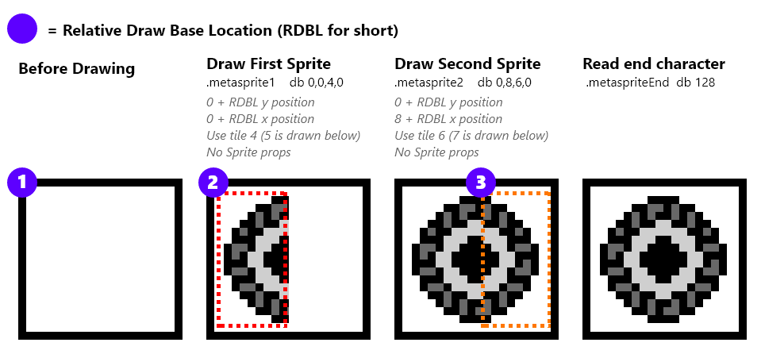

# Sprites & Metasprites

Before we dive into the player, bullets, and enemies; how they are drawn using metasprites should be explained.

For sprites, the following library is used:  https://github.com/eievui5/gb-sprobj-lib

> This is a small, lightweight library meant to facilitate the rendering of sprite objects, including Shadow OAM and OAM DMA, single-entry "simple" sprite objects, and Q12.4 fixed-point position metasprite rendering.

All objects are drawn using "metasprites", or groups of sprites that define one single object. A custom “metasprite” implementation is used in addition. Metasprite definitions should a multiple of 4 plus one additional byte for the end.

- Relative Y offset ( relative to the previous sprite, or the actual metasprite’s draw position)
- Relative X offset ( relative to the previous sprite, or the actual metasprite’s draw position)
- Tile to draw
- Tile Props (not used in this project)

The logic stops drawing when it reads 128. 

An example of metasprite is the enemy ship:


```rgbasm,linenos,start={{#line_no_of "" ../../galactic-armada/main.asm:enemy-metasprites}}
{{#include ../../galactic-armada/main.asm:enemy-metasprites}}
```



The Previous snippet draws two sprites. One that the object’s actual position, which uses tile 4 and 5. The second sprite is 8 pixels to the right, and uses tile 6 and 7

>⚠️ **NOTE**: Sprites are in 8x16 mode for this project.

I can later draw such metasprite by calling the "DrawMetasprite" function that

```rgbasm,linenos,start={{#line_no_of "" ../../galactic-armada/main.asm:draw-enemy-metasprites}}
{{#include ../../galactic-armada/main.asm:draw-enemy-metasprites}}
```

We previously mentioned a variable called "wLastOAMAddress". The "DrawMetasprites" function can be found in the "src/main/utils/metasprites.asm" file:

```rgbasm,linenos,start={{#line_no_of "" ../../galactic-armada/src/main/utils/metasprites.asm}}
{{#include ../../galactic-armada/src/main/utils/metasprites.asm}}
```

When we call the "DrawMetasprites" function, the "wLastOAMAddress" variable will be advanced  to point at the next available shadow OAM sprite. This is done using the "NextOAMSprite" function in "src/main/utils/sprites-utils.asm"

```rgbasm,linenos,start={{#line_no_of "" ../../galactic-armada/src/main/utils/sprites-utils.asm:next-oam-sprite}}
{{#include ../../galactic-armada/src/main/utils/sprites-utils.asm:next-oam-sprite}}
```
