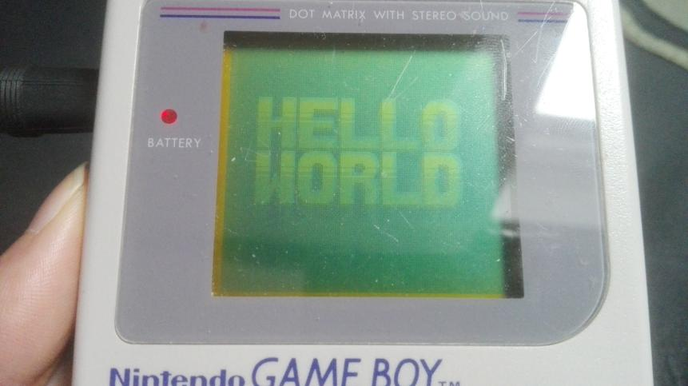

# Hello World!

In questa lezione, assembleremo il nostro primo programma, mentre nel resto del capitolo spiegheremo come funziona.

Dovremo scrivere molti comandi, quindi inizia aprendo un terminale.
Per tenere tutto più ordinato crea una nuova cartella (`mkdir gb_hello_world` ne crea una chiamata gb_hello_world, e `cd gb_hello_world` entra nella cartella).

Inizia salvando questi file (click destro sul link e poi "Salva link come...") nella cartella che hai creato:
- [`hello-world.asm`](../assets/hello-world.asm)
- [`hardware.inc`](https://raw.githubusercontent.com/gbdev/hardware.inc/v4.0/hardware.inc)

Fatto questo esegui questi comandi nel terminale dalla stessa cartella.

::: warning:⚠️

Per far capire meglio dove inizia ogni comando c'è un `$` prima dell'inizio di ognuno, ma non scriverlo nel terminale!

:::

```console
$ rgbasm -L -o hello-world.o hello-world.asm
$ rgblink -o hello-world.gb hello-world.o
$ rgbfix -v -p 0xFF hello-world.gb
```

<style>
	.box.danger ol {
		list-style-type: symbols(fixed "👎" "👍" "👍");
	}
</style>

::: danger:‼️

Stai molto attento alle opzioni del comando! Alcune di esse usano il testo dopo di loro come parametro:

1. `rgbasm -L -o hello-world.asm hello-world.o` non funzionerà (o potrebbe persino rendere `hello-world.asm` inutilizzabile!)
2. `rgbasm -L hello-world.asm -o hello-world.o` funzionerà
3. `rgbasm hello-world.asm -o hello-world.o -L` funzionerà ugualmente

Se hai bisogno di inserire spazi in un comando (ad esempio per il nome di un file) usa le doppie virgolette:

1. `rgbasm -L -o hello world.o hello world.asm` non va bene
2. `rgbasm -L -o "hello world.o" "hello world.asm"` va bene

:::

Eseguiti questi comandi dovresti avere un risultato del genere:
<script id="asciicast-weljUlcp1KC5GqS9jqV62dy5m" src="https://asciinema.celforyon.fr/a/weljUlcp1KC5GqS9jqV62dy5m.js" async></script>

(Se dovessi avere un problema che non riesci a risolvere per conto tuo, non preoccuparti e [chiedi](../index.md#feedback) subito! Ti aiuteremo a risolverlo il prima possibile.)

Congratulazioni!
Hai assemblato la tua prima ROM per il GameBoy!
Ora per provarla tutto ciò che devi fare è aprire `hello-world.gb` nel tuo emulatore di fiducia (nel nostro caso BGB).

<video controls poster="../assets/vid/hello_world.poster.png">
	<source src="../assets/vid/hello_world.webm" type="video/webm">
	<source src="../assets/vid/hello_world.mp4" type="video/mp4">

	
</video>

::: danger:🤕

Se usi Wine per usare BGB ma non riesci a farlo funzionare (o se la finestra è vuota o nera) [dai un'occhiata a questa pagina di aiuto](https://eldred.fr/bgb#getting-started-on-wine).

E come sempre, non esitare mai a chiederci aiuto!

:::

Volendo potresti anche comprare una Flash Cart (per esempio la [EverDrive GB X5](https://krikzz.com/store/home/47-everdrive-gb.html), ma è pieno di alternative), caricarci la ROM e vederla in azione sul vero GameBoy!



E adesso non ci resta altro che sbirciare e vedere cosa succeda dietro le quinte...
