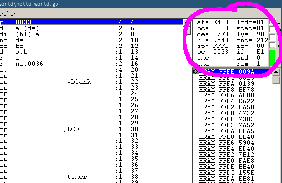

# Registers

Bene!
Ora che sappiamo cosa sono i bit, cerchiamo di capire come si usano.
Non ti preoccupare, tutto questo è per lo più in preparazione alla prossima parte, dove ci butteremo finalmente nel vero e proprio codice 👀

Per iniziare, se hai già provato ad aprire BGB ti sarà comparso solo lo schermo del GameBoy.
Ora è il momento di aprire il debugger!
Apri il menu facendo clic destro sullo schermo, vai su "Other", e scegli "Debugger".
E già che ci siamo, aumentiamo un po' la dimensione della finestra.

<video controls poster="../assets/vid/debugger.poster.png">
	<source src="../assets/vid/debugger.webm" type="video/webm">
	<source src="../assets/vid/debugger.mp4" type="video/mp4">

	
</video>

Il debugger potrebbe sembrare incomprensibile all'inizio, ma non ti preoccupare: ti ci abituerai in fretta!
Per il momento guarda in alto a destra, dove c'è un piccolo spazio chiamato _register viewer_ (visualizzatore dei registri).

::: warning:⚠️

Il visualizzatore mostra sia i _registri della CPU_ che alcuni _registri hardware_.
In questa lezione parleremo solo dei registri della CPU, perciò non ti preoccupare se non menzioniamo alcuni dei nomi.

:::

Ma cosa sono questi registri della CPU?
Ti faccio un esempio: immagina di star preparando una torta.
Ovviamente avrai una ricetta da seguire, come ad esempio "sciogli 125g di cioccolato e 125g di burro, mescola il tutto con due uova" e così via.
Dopo aver preso gli ingredienti, non li usi direttamente nel frigo; per comodità, li prenderai e li metterai su un tavolo dove lavorarci più facilmente.

I registri sono questo tavolo, su cui la CPU poggia temporaneamente i suoi ingredienti.
Più concretamente, sono dei piccoli spazi di memoria (Il GameBoy ne ha solo 10 byte, e anche le CPU moderne hanno meno di un kilobyte se non si contano i registri <a href="https://it.wikipedia.org/wiki/SIMD"><abbr title="Single Instruction, Multiple Data">SIMD</abbr></a>).
Eseguire le operazioni direttamente sulla memoria è scomodo, sarebbe come rompere le uova nel frigo: per questo le spostiamo sul tavolo, i registri, prima di romperle.

::: tip:ℹ️

Ovviamente ci sono eccezioni a questa regola, come un po' tutte le regole che ti spiegheremo nel tutorial; stiamo semplificando di molto le cose per mantenerle ad un livello abbastanza facile da comprendere, perciò non prendere mai queste regole troppo alla lettera.

:::

<!-- TODO: "registro generico" o "registro di dati"? -->
## Registri generici

A grandi linee ci sono due tipi di registri: _registri generici_ e _registri specifici_.
Un registro generico (abbreviato <abbr title="inglese: General-Purpose Register">GPR</abbr>) può essere usato per dati di qualunque tipo.
Qualche GPR ha anche delle funzioni speciali, come vedremo più in là; ma per distinguerli da quelli specifici chiediti "posso usarli per dati arbitrari?".

Parleremo poi dei registri specifici;
hanno funzioni particolari che non abbiamo ancora spiegato, perciò li spiegheremo quando parleremo della funzione specifica visto che fino ad allora non ci serviranno.

Il processore del GameBoy ha sette GPR ad 8 bit: `A`, `B`, `C`, `D`, `E`, `H`, ed `L`.
"8 bit" vuol dire, beh, che hanno otto bit.
Questo significa che contengono un numero intero da 0 a 255 (ovvero %1111_1111 o $FF).

`A` è l'_accumulatore_, che come vedremo poi ha anche degli usi particolari.

Questi registri hanno un'altra caratteristica interessante; sono tutti _accoppiati_ ad un altro registro (tranne `A` che è unito ad un registro speciale, l'`F`), e queste coppie possono funzionare da registri a 16 bit: `BC`, `DE`, e `HL`.
Ma tieni sempre a mente che le coppie _non_ sono indipendenti dai registri che li formano; se, ad esempio, `D` contiene 192 ($C0) ed `E` 222 ($DE) allora `DE` conterrà 49374 ($C0DE) = `D × 0x100 + E`.
Tutte le altre coppie funzionano allo stesso modo.

Quindi, cambiare il valore di `DE` modifica sia quello di `D` che di `E` allo stesso tempo e modificare `D` o `E` cambierà il valore della coppia `DE`.

Ok, ma come facciamo a modificare i registri?
 
È il momento di dare un'occhiata all'Assembly!
